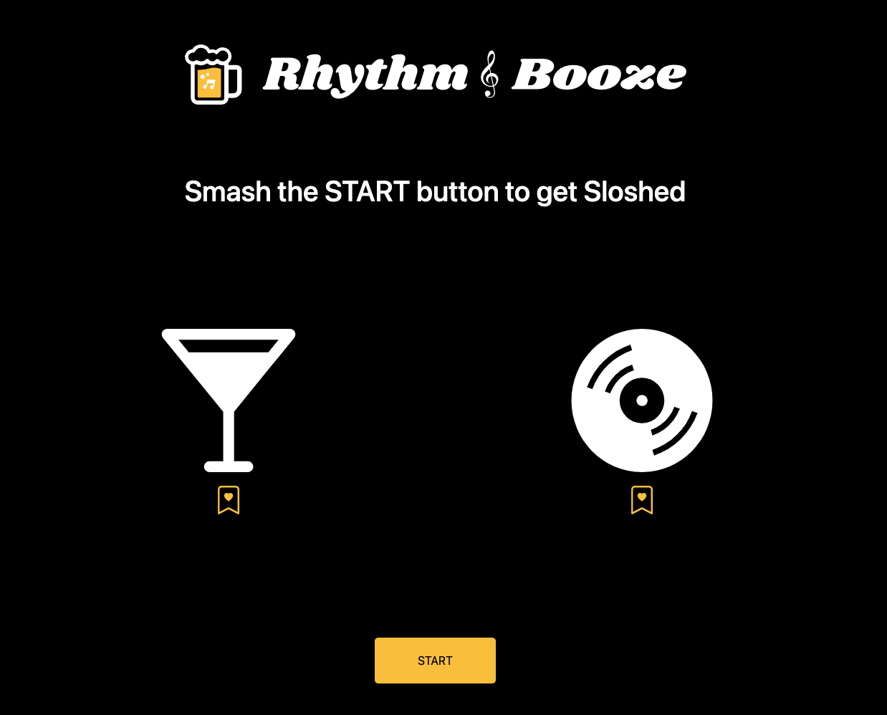

# <Rhythm & Booze>

# Description

The main motivation for this project was to create a simple user-friendly page for those evenings where you just can’t figure out what to do.. The purpose of this project is undefined to solve any indecisiveness that is preventing from you to have the most fun and efficient evening.. 
From this process I have leared these follwoing lessons: It is challenging to extract only wanted data from Third Party API's .

# Table of Contents 

- [Installation](#installation)
- [Usage](#usage)
- [Credits](#credits)
- [License](#license)
- [Badges](#badges)
- [Features](#features)
- [How to Cotribute](#how-to-contribute)
- [Tests](#tests)
- [Questions](#questions)

# Installation

Here are the steps required to install this application. Follow this live link: https://addiguskey.github.io/Rhythm-and-Booze/  

# Usage

# Credits

Addi Guskey(https://github.com/addiguskey?tab=repositories)

# License

This application is covered under MIT

---

# Badges

     

# Features

Not available at the moment

# How to Contribute

Not available at the moment

# Tests

Not available at the moment

# Questions

For any questions, you can either reach out to me on GitHub or via e-mail
- Username: @addiguskey
- GitHub Link: https://github.com/addiguskey
- E-mail: addisonguskey@gmail.com
