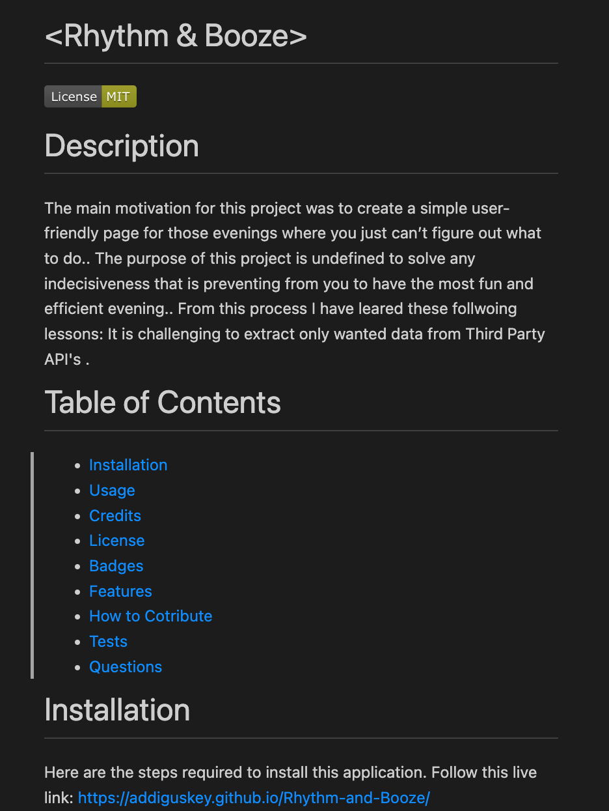
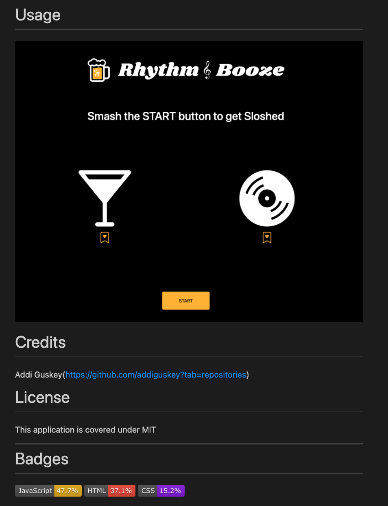
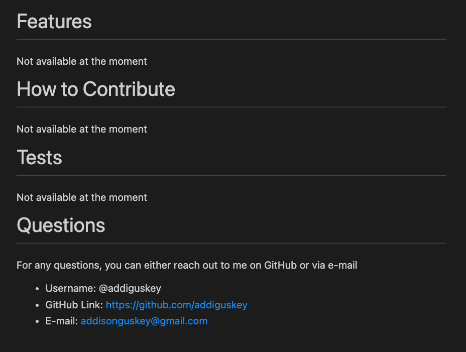

# < Dynamic-README.md-Generator >

# Motivation

As a FullStack coding student, GitHub is where I store and present all of my projects. Each project has a README.md file- meaning, I have been greating each README.md file for each project. The main motivation and purpose for this specific project was to create a dynamic and professional README.md generator for all of my future repositories. This will not only increase efficiency, but also save time and allow each REAME.md file to be clean and professional.

# Table of Contents

- [Installation](#installation)
- [Usage](#usage)
- [Example README.md](#example-read-me)
- [Questions](#questions)

# Installation

- GitClone Link: ( git@github.com:addiguskey/Automatic-ReadME-Generator.git )

1. Copy& Paste GitClone Link provided above in your project Terminal(Mac) or GitBash(Windows)
2. run "node index.js" in your Integrated Terminal within the project (Must have [Node.js](https://nodejs.org/en/) installed)
3. Answer given prompt questions to generate a professional, dynamic README.md (Demonstrated in the Walk-Through GIF in the Usage section below)

# Usage

GIVEN a command-line application that accepts user input

- WHEN I am prompted for information about my application repository
  THEN a high-quality, professional README.md is generated with the title of my project and sections entitled Description, Table of Contents, Installation, Usage, License, Contributing, Tests, and Questions
- WHEN I enter my project title
  THEN this is displayed as the title of the README
- WHEN I enter a description, installation instructions, usage information, contribution guidelines, and test instructions
  THEN this information is added to the sections of the README entitled Description, Installation, Usage, Contributing, and Tests
- WHEN I choose a license for my application from a list of options
  THEN a badge for that license is added near the top of the README and a notice is added to the section of the README entitled License that explains which license the application is covered under
- WHEN I enter my GitHub username
  THEN this is added to the section of the README entitled Questions, with a link to my GitHub profile
- WHEN I enter my email address
  THEN this is added to the section of the README entitled Questions, with instructions on how to reach me with additional questions
- WHEN I click on the links in the Table of Contents
  THEN I am taken to the corresponding section of the README

# Example REAME.md using the Generator

# Questions

For any questions, you can either reach out to me on GitHub or via e-mail

- Username: @addiguskey
- GitHub Link: https://github.com/addiguskey
- E-mail: addisonguskey@gmail.com
